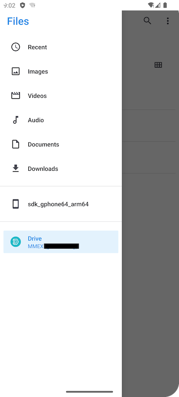

Money Manager EX supports [Bring Your Own Cloud](../../docs/features/usecloud/), and this article provides a detailed guide on setting up MMEX with Synology Drive for data sharing on your Android device.

## Preparation
You'll need a device running Android 5.1 or newer and a cloud provider account. In this guide, we'll use Synology Drive.

### Install Synology Drive
1. Install the Synology Drive app on your device from your preferred source or directly from the [Synology Download Center](https://www.synology.com/en-sg/support/download/DS920+?version=7.2#androids).
2. Ensure you have Synology Drive app version: `3.6.0-982`.
3. Log in to the Synology Drive app with your account to ensure it's working correctly.
4. Open the Files app to confirm it can access your Synology Drive.

### Install Money Manager EX
1. Install MMEX4Android on your device from [F-Droid](https://f-droid.org/packages/com.money.manager.ex/) or [GitHub](https://github.com/moneymanagerex/android-money-manager-ex/releases).
2. Ensure you have MMEX app version: `2024-05-09 (1032)`.

## Create MMEX Database in Synology Drive
1. Open the MMEX app (grant permissions if prompted).
2. If this is your first time opening the app, choose `CREATE DATABASE`. If not, tap `三 -> Create Database`.
3. Navigate to your preferred folder in Synology Drive and set a file name.
4. Leave the password field empty if your file name ends with `.mmb`.
5. If your file name ends with `.emb`, input and remember your password.

## Open MMEX Database in Synology Drive
1. Open the MMEX app (grant permissions if prompted).
2. If this is your first time opening the app, choose `OPEN DATABASE`. If not, tap `三 -> Open Database -> Other`.
3. Navigate to your preferred folder in Synology Drive and select the database file.
4. Input and remember your password if your file name ends with `.emb`.

## Other Cloud Services
Synology Drive is a private cloud solution. Other public and private cloud services can be set up in a similar manner.

## Sync Tools
Sync tools (e.g., `Syncthing`) will rely on phone storage (e.g., Documents, Downloads). Detailed instructions for these tools are TBD.

## Verifying Synology Drive Connection
To verify that your Synology Drive is properly connected with your phone and MMEX app:
1. Ensure the Files app can access Synology Drive properly.

2. Confirm the MMEX app can access/open Synology Drive properly.

3. Verify the MMEX first open screen after installation.

## Enable Synchronization
Enable synchronization in the MMEX app via `三 -> Settings -> Synchronization`.

