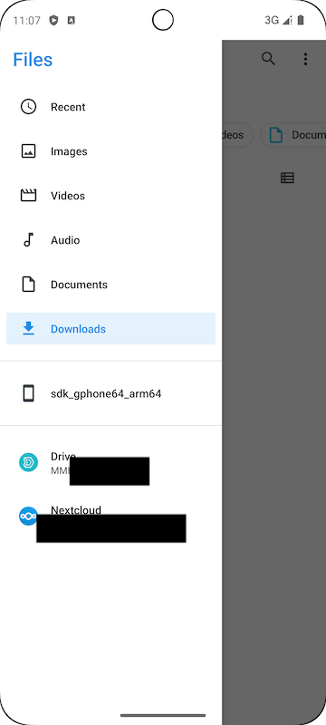
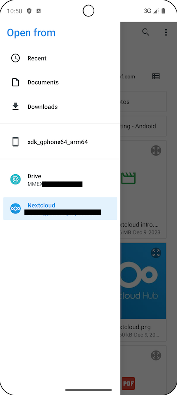

Money Manager EX supports [Bring Your Own Cloud](../../docs/features/usecloud/), and this article provides a detailed guide on setting up MMEX with NextCloud for data sharing on your Android device.

## Preparation
You'll need a device running Android 5.1 or newer and a NextCloud account.

### Install NextCloud
1. Install the NextCloud app on your device from your preferred source or directly from the [NextCloud GitHub](https://github.com/nextcloud/android/releases).
2. Ensure you have NextCloud app version: `v3.29.0`.
3. Log in to the NextCloud app with your account to ensure it's working correctly.
4. Open the Files app to confirm it can access your NextCloud.

|    |    |   
| --- | --- |
|  |  |

### Install Money Manager EX
1. Install MMEX4Android on your device from [F-Droid](https://f-droid.org/packages/com.money.manager.ex/) or [GitHub](https://github.com/moneymanagerex/android-money-manager-ex/releases).
2. Ensure you have MMEX app version: `2024-06-14 (1033)`.

## Create MMEX Database in NextCloud
1. Open the MMEX app (grant permissions if prompted).
2. If this is your first time opening the app, choose `CREATE DATABASE`. If not, tap `三 -> Create Database`.
3. Navigate to your preferred folder in NextCloud and set a file name.
4. Leave the password field empty if your file name ends with `.mmb`.
5. If your file name ends with `.emb`, input and remember your password.

|    |   
| --- |
|  |

## Open MMEX Database in NextCloud
1. Open the MMEX app (grant permissions if prompted).
2. If this is your first time opening the app, choose `OPEN DATABASE`. If not, tap `三 -> Open Database -> Other`.
3. Navigate to your preferred folder in NextCloud and select the database file.
4. Input and remember your password if your file name ends with `.emb`.

## Other Cloud Services
NextCloud is a private cloud solution. Other public and private cloud services can be set up in a similar manner.

## Sync Tools
Sync tools (e.g., `Syncthing`) will rely on phone storage (e.g., Documents, Downloads). Detailed instructions for these tools are TBD.

## Enable Synchronization
Enable synchronization in the MMEX app via `三 -> Settings -> Synchronization`.

