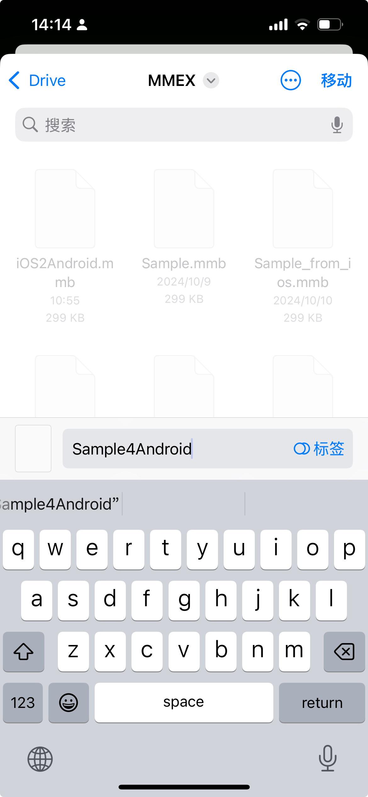
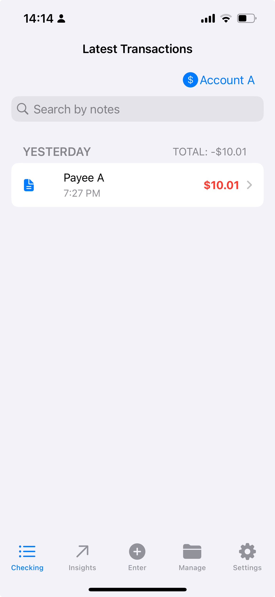
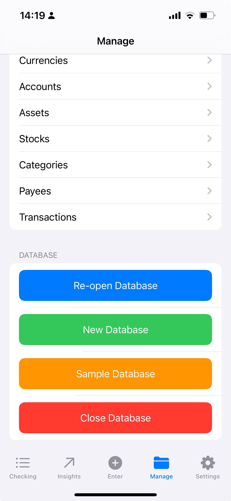
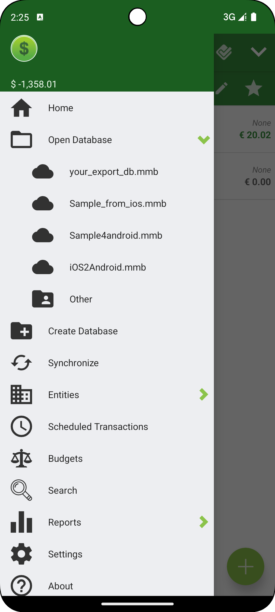
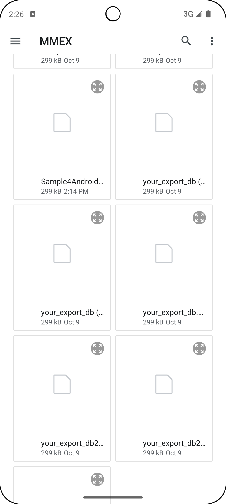
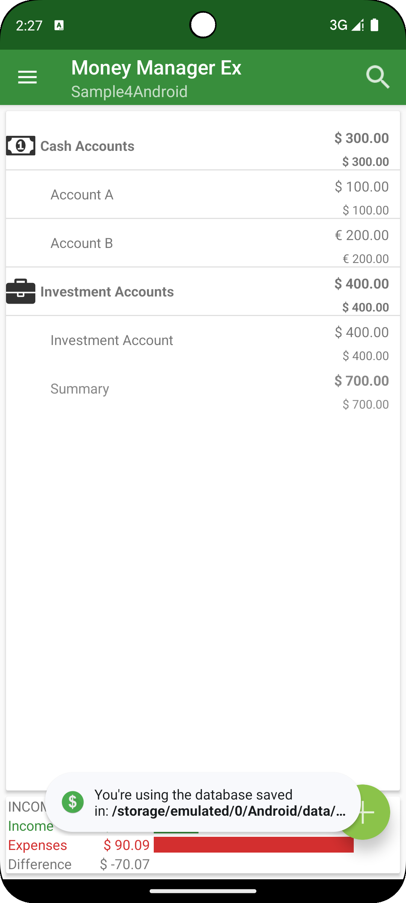
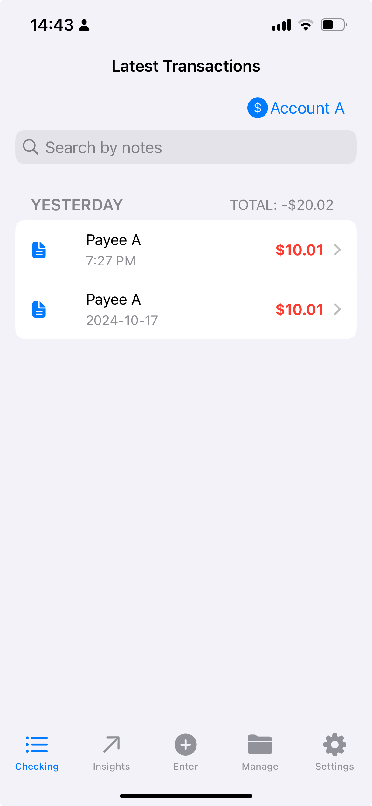

With the valuable support of both [Guangong](https://github.com/guanlisheng) and [George Ef](https://github.com/georgeef), we have launched the beta version of MMEX for iOS. We invite you to join our beta testing via [TestFlight](https://testflight.apple.com/join/SYakQaAv).

In this guide, we will explain how to sync your MMEX database between your iOS and Android devices.

## Preparation

1. Set up MMEX on your Android device by following [MMEX Cloud Storage with Synology Drive](../2024-06-13\ MMEX\ Cloud\ Storage\ Starts\ from\ Synology\ Drive/).
2. Install Synology Drive and the latest version of MMEX4iOS on your iOS device.
3. Log in to your Synology Drive account on both devices and create a dedicated folder for syncing MMEX data (e.g., "MMEX").

## Create a Sample Database in MMEX4iOS

1. Open MMEX on your iPhone and tap `Create and Use Sample Database`.
2. Name the database (e.g., `Sample4Android`), choose the appropriate folder, and tap `Move` in the top-right corner.
3. MMEX will automatically open the newly created database. You should see some sample data in the `Checking` tab.
4. Navigate to the `Manage` tab and select `Close Database` to ensure any changes are saved.

    
    
    
    

## Open the Sample Database in MMEX4Android

1. Open MMEX on your Android device, then tap `三 -> Open Database -> Other ->`.
2. Select the same folder you used in Synology Drive.
3. MMEX will load the database and display it in the main landing widget.
4. Tap `Account A`, and duplicate an existing transaction to add a new one.
5. Tap `三 -> Synchronize` to manually sync the changes with the remote cloud provider.

    
    
    
    
    

## Reopen the Database in MMEX4iOS to View the Latest Changes

1. Reopen MMEX on your iPhone, and this time select `Open Database`.
2. Navigate to the same folder used earlier.
3. Long-press the sample database file and tap `Remove Download` to delete the outdated local copy.
4. Tap the sample database again to open it, and you will see the latest transaction added from your Android device.

    
    

## Notices
1. MMEX4iOS is still in beta phase
2. Cloud Provider might have some latency, please check file's modificaiton time
4. Long-press and tap `Remove Download` is mandoary to purge privous local copy
