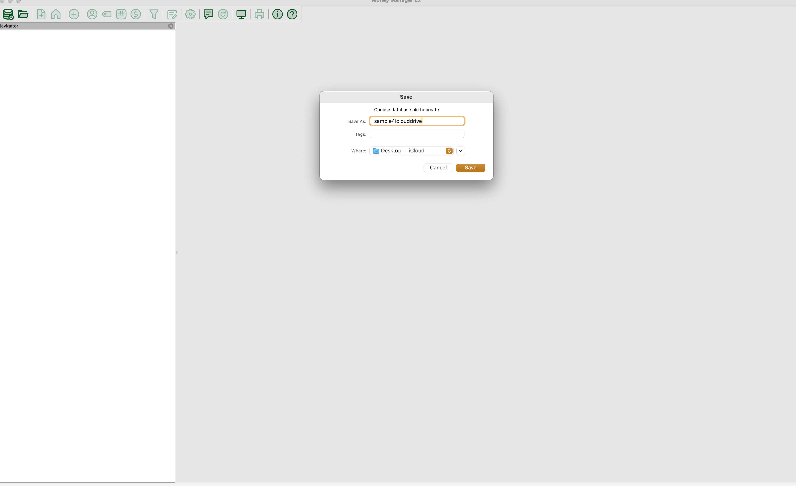
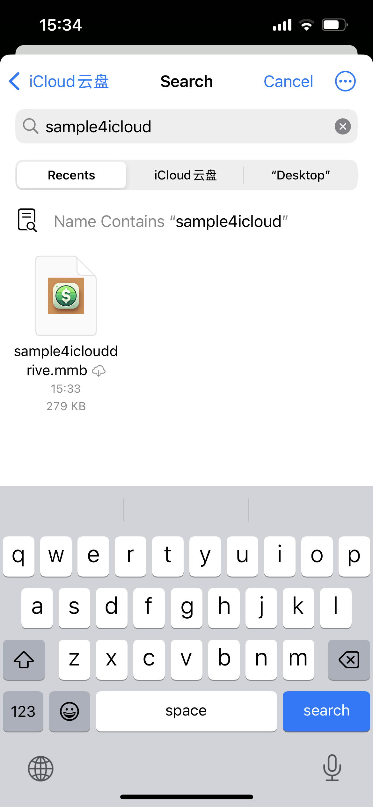
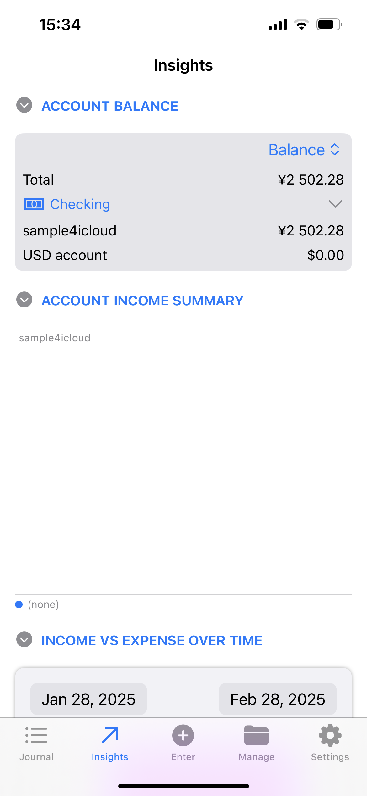
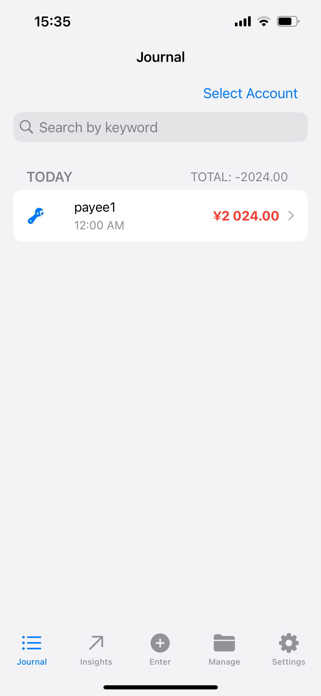
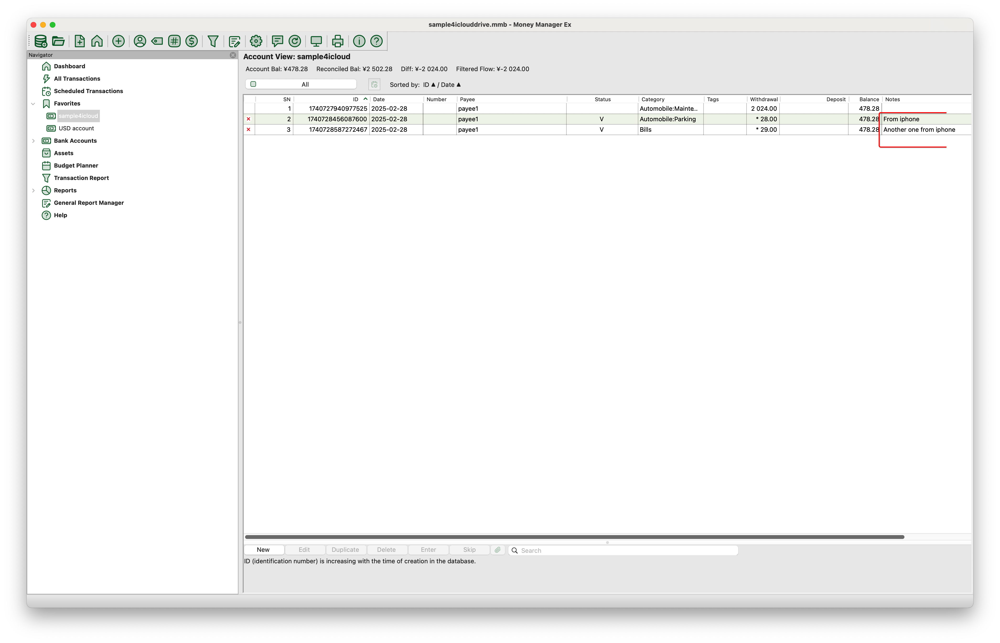

We’re excited to announce the integration of MMEX on iOS and Mac via iCloud, enabling you to sync your MMEX data effortlessly between devices. Whether you're managing finances on your iPhone or Mac, this seamless sync ensures that your data stays up-to-date across both devices.

Follow this guide to sync your MMEX data between iOS and Mac using iCloud.

## Preparation

1. Install MMEX on both your iPhone (version 0.1.28) and Mac (version 1.9).
2. Ensure that iCloud is enabled and configured on both devices.
3. Make sure you have access to iCloud Drive on both devices.

## Step 1: Create a Sample Database on Mac

1. Launch MMEX on your Mac and select `Create Database`.
2. Save the database to the iCloud Drive folder (e.g., `iCloud/Desktop`).
3. Name the database (e.g., `sample4iclouddrive`) and initialize the data.
4. Close MMEX on your Mac to save and sync the database to iCloud.

    
    

## Step 2: Wait for iCloud Sync

After closing MMEX on your Mac, wait a few moments for iCloud to sync the database. This may take a couple of minutes depending on your internet connection and file size.

## Step 3: Open the Sample Database on iPhone

1. Open MMEX on your iPhone.
2. Tap `Open Database` and navigate to the iCloud Drive folder where you saved the database (`iCloud/Desktop`).
3. Select the database (`sample4iclouddrive`) and open it.
4. You should see the initialized data from your Mac, including accounts, categories, etc.

    
    
    

## Step 4: Add Transactions on iPhone

1. On your iPhone, navigate to the `Transactions` section.
2. Add two new transactions to the database.
3. Close MMEX on your iPhone to save and sync the changes.

## Step 5: Wait for iCloud Sync

Allow iCloud to sync the changes from your iPhone to the cloud. This may take a few minutes depending on your internet connection.

## Step 6: Reopen the Database on Mac

1. Open MMEX on your Mac.
2. Navigate to the same iCloud Drive folder (`iCloud/Desktop`) and select the database (`sample4iclouddrive`).
3. The new transactions you added on your iPhone will now appear on your Mac.

    

## Notices

1. MMEX for iOS (version 0.1.28) and MMEX for Mac (version 1.9) are both required for full iCloud sync support.
2. Ensure that iCloud is properly configured and enabled on both devices.
3. iCloud sync may take some time depending on your internet connection and the file size.
4. **Important:** After making changes on your Mac, close MMEX on your Mac to ensure the database is properly synced to iCloud.
5. **Important:** On your iPhone, always go to `Manage -> Close Database` after making changes to ensure proper sync before closing MMEX.
