

This guide provides a detailed example of how to record an asset purchase in MMEX, from initial setup to tracking value changes over time.

## In the Real World - The Purchase

I bought a property for **£100,000** on **21 June 2000** as a cash buyer. The legal fees for the purchase were **£1,000**.

- **19 June**: My bank balance was over **£102k**.
- **20 June**: I transferred **£101k** to a solicitor.
- **21 June**: The property was registered in my name, and my net worth changed:
  - **19 June**: £102k in the bank.
  - **20 June**: £1k in the bank.
  - **21 June**: £101k net worth (including property).

## In MMEX - Recording the Purchase

### Step 1: Bank Account Setup

I had one bank account with a reconciled balance of over **£101k** before **2000-06-19**, ensuring I could afford the property.

    
    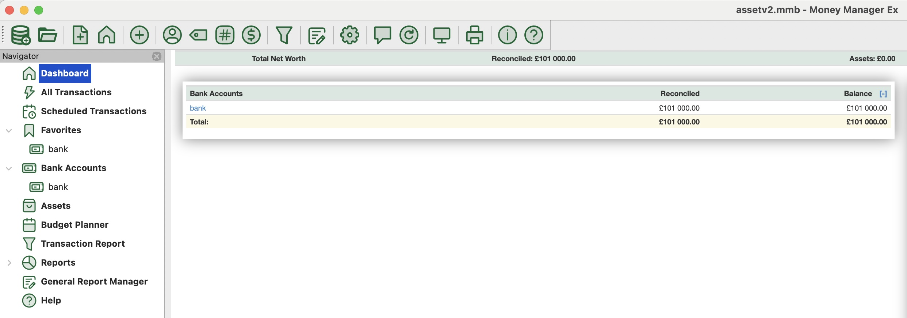

### Step 2: Creating the Asset and Account

On **2000-06-19**, I created:
- An asset **"property-1"** with an initial value of **£0**.
- An asset account **"property-1"** with an initial balance of **£0**.

**Recommended Approach:**
1. Create an **Asset Account** first with name(**Property**) or name (**property-1**).
2. Create an **Asset** with the type(**Property**) or the exact same name (**property-1**).

    
    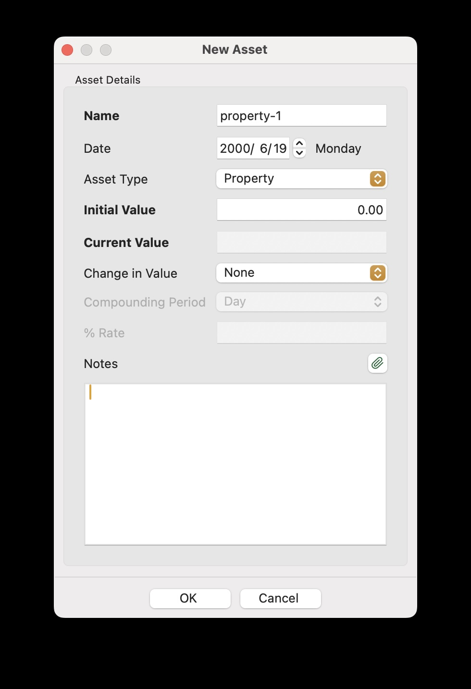

### Step 3: Transferring Funds

On **2000-06-20**, I recorded:
- A **£100k transfer** from the bank account to the asset account.
- A **£1k withdrawal** from the bank account, with payee **"Solicitor"**.

**Recommended Approach:**  
Transfer **£101k** directly for clearer cash tracking.

    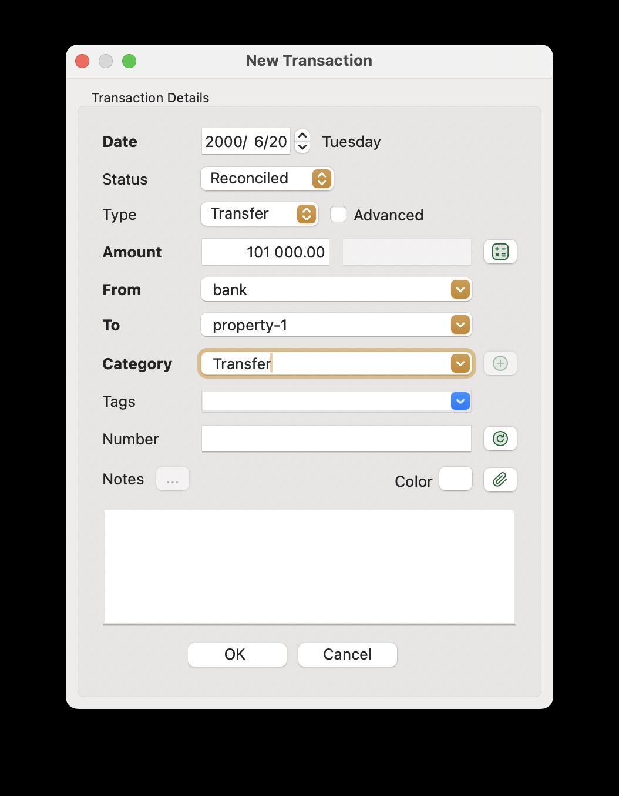
    

### Step 4: Recording the Asset Purchase

On **2000-06-21**, I created an asset transaction:
- A **£100k withdrawal/transfer** with payee **"Vendor"**.

**Recommended Approach:**  
Record a **£101k purchase** in the asset transaction to reflect the full expense.

    
    
    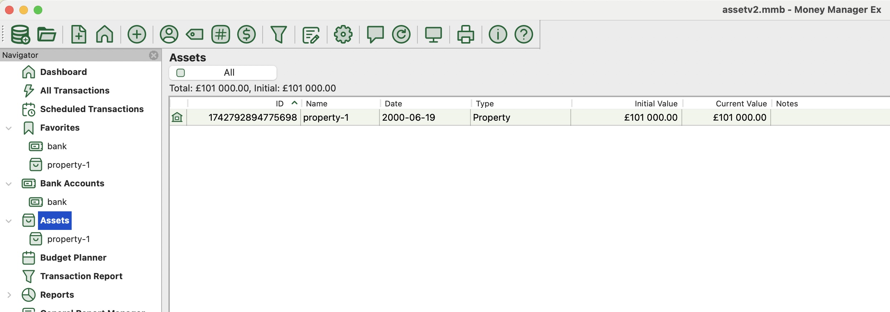

### Step 5: Revaluing the Asset

After purchase, the property’s real value was **£100k**. The £1k legal fee was already included in the £101k total, making this a more accurate reflection of investment cost and ROI or G/L calculations.

    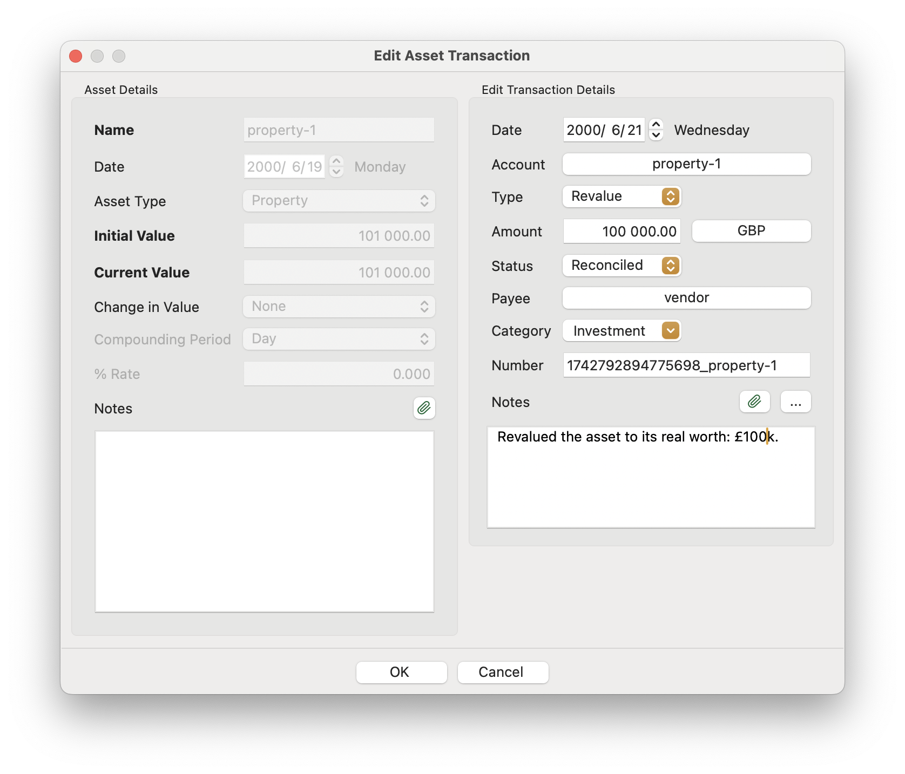
    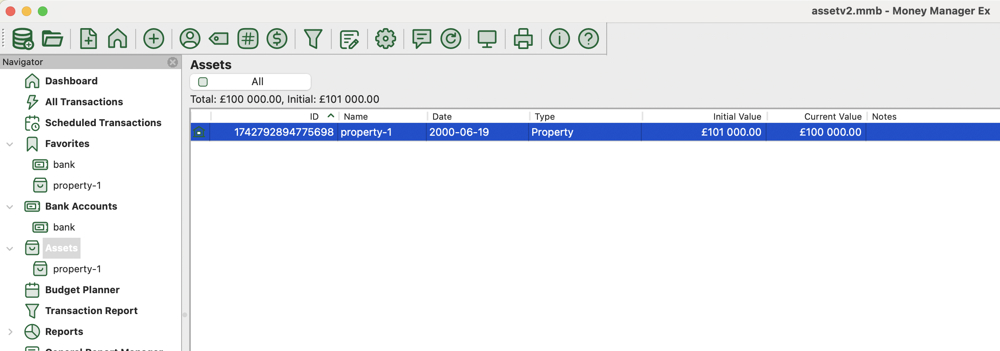

### Step 6: Applying a 5% Yearly Growth Rate

To reflect appreciation, I applied a **5% annual growth rate**.

    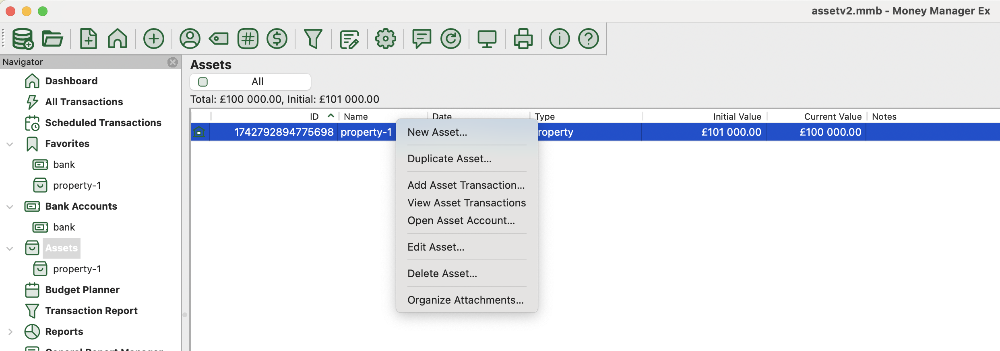
    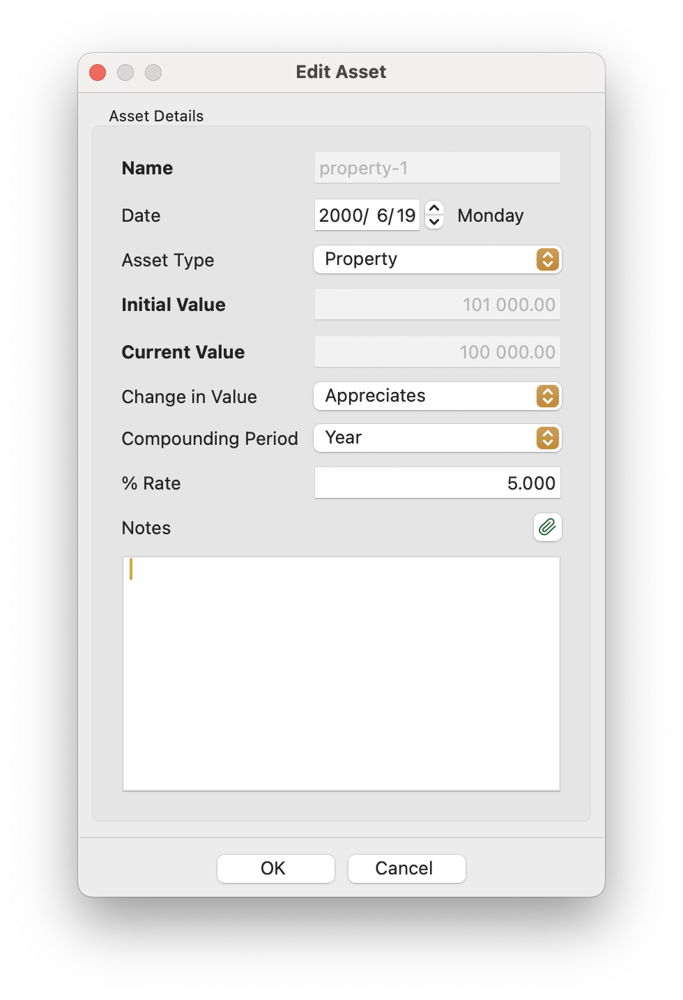
    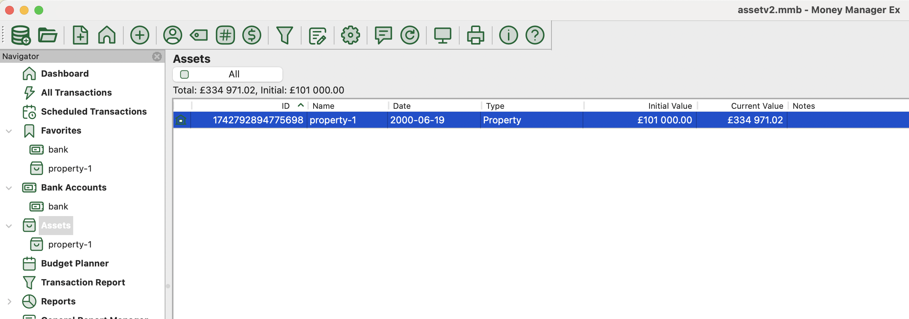
    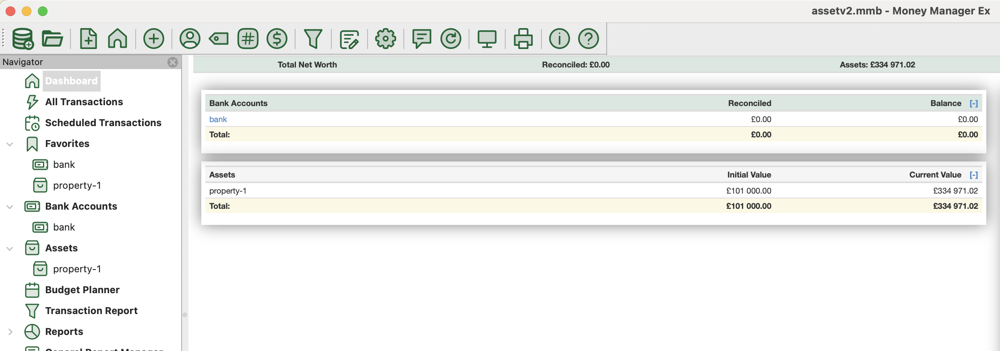

### At last: Review All Details and Perform Modifications If Any

    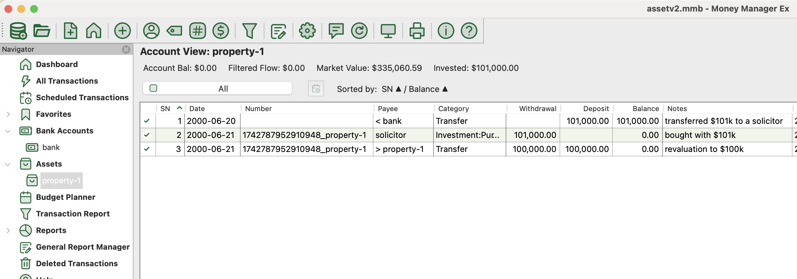
    

## Conclusion

By following these steps, you can accurately record an asset purchase in MMEX, ensuring clear financial tracking. The **£101k investment**, including legal fees, is properly reflected, and asset appreciation is tracked over time. This approach provides a precise view of **net worth** and **ROI**.

## References
1. [Assets - a worked example](../assets-a-worked-example/)
