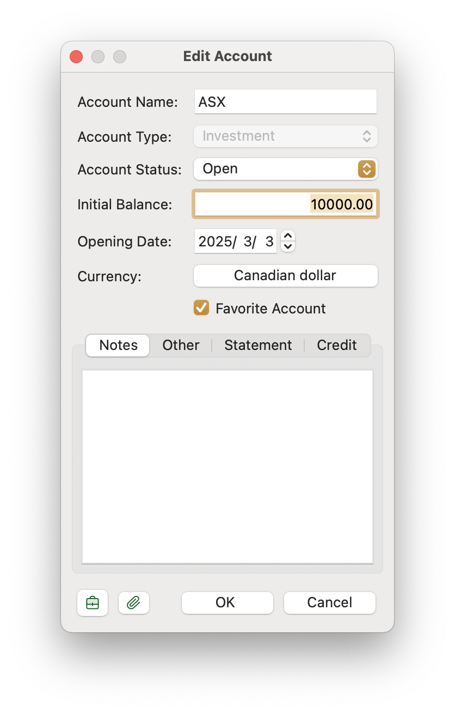

Money Manager Ex allows the tracking of **stocks and shares** to be incorporated with our general day-to-day transactions. **Stock holdings** have been updated to allow money from our general accounts to be transferred to and from our **investment accounts**. This also allows the payment of **dividends** to be recorded against our stock holdings. To facilitate this, a **share account** is created when we add a new stock (would re-use the investment account). This also allows us to **purchase additional shares** in a stock or **sell shares** from our holdings.

We often use the terms **stocks** and **shares** interchangeably. Here, we define:

- **Stocks** as the **companies** in which we invest.
- **Shares** as **units of ownership** in a company.
- Generally, we acquire stocks through a **stockbroker** or **financial institution**, where we can **buy and sell shares** on the market.

## Initializing Stocks and Shares

Before we can manage stocks and shares, we need to create a new **Investment Account**.
This account will allow us to manage stocks held under this investment. This is known as the **investment account**, and multiple accounts can be created to hold different portfolios.

    
    

## Adding a New Stock

Adding a new stock involves a **two-step process**. When we select our **investment account** from the navigation panel, the **stock portfolio** for this investment is displayed. If no stock is selected, a new stock can be created.

- A **New Stock Investment** dialog appears, where we enter the initial details of our stock. At this point, the **initial price** is the **current market price**.
- Upon saving, a **share account** is created with the same name as the **company name**, followed by the **Add Share Transaction** dialog, where we enter additional details related to the stock purchase.
- The same stock can have multiple entries, each representing a separate purchase per LOT.

This dialog is used when creating a new stock or editing an existing stock. Saving this dialog updates the stock's details, including **current market price updates**, which are recorded in the **stock price history**.

## Adding and Managing Shares 

The following dialog appears when we create a new **share transaction** for a stock or edit an existing transaction in the **share account**. Shares can be **bought or sold** using the **Share Transaction** dialog.

This dialog represents:
- **The investment portion (left panel)**
- **The transaction portion (right panel)**

- The **Share Account** holds two types of transactions:
    - When a new stock is created, an **initial share transaction** is recorded.
    - **Share transactions** store details such as **quantity, purchase price, and transaction type**.
    - **Regular transactions** track the flow of money between investment accounts and regular accounts.
- Creating a new transaction from the **Stock Portfolio View** allows us to **increase or reduce holdings**, depending on the transaction type:
    - **Sell (Deposit)**: Proceeds from selling shares are deposited into regular accounts.
    - **Buy (Withdrawal)**: Funds are withdrawn from regular accounts to purchase shares.
    - **Transfer**: The transaction is treated as a **capital movement** rather than an income or expense entry.

## Buying & Selling Shares

A **share purchase or sale** is recorded as a transaction in the **stock portfolio view**. 

- The **portfolio view** summarizes the **total number of shares held** for each stock within an investment.
- Individual transactions are stored in the **share account**, accessible via the navigation panel, providing a **detailed transaction history** for the stock.

## Updating Current Stock Prices

Stock prices can be updated **manually** or **automatically**:

- **Manual Update**: Edit the **current price** field in the **Edit Stock** dialog and save changes.
- **Automatic Update**:
  - Click the **update button** in the **Stock Portfolio View**.
  - The **stock symbol** must be correctly recorded.
  - Price data is retrieved from **Yahoo Finance**.
  - Clicking the **home button** opens the stock’s page on Yahoo.

## Demonstration Video on How to Use the Feature


