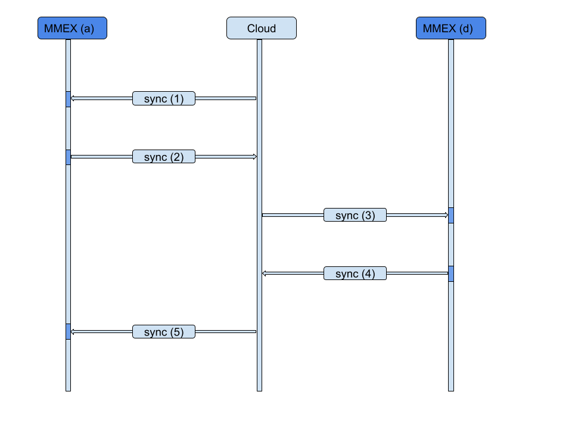

You are not tied to a specific cloud provider. With MMEX, you have the flexibility to store your database files using your chosen:

- **Public Cloud Provider**:
    - Google Drive
    - Microsoft OneDrive
    - Dropbox, etc.

- **Private Cloud Provider**:
    - NextCloud
    - Synology NAS, etc.

- **Phone Storage + Sync Tools**:
    - Syncthing, etc.

Once the Bring Your Own Cloud (BYOC) is set up on all your devices:

**For Desktop MMEX**:
- Install your preferred cloud provider client and set its synchronization
- Simply locate your database on the shared area provided by your chosen cloud provider.
- The BYOC system syncs the data to the cloud.

**For Android MMEX**:
- Install your preferred cloud provider client and set its synchronization
- Open or create your database on the shared area provided by your cloud provider.
- Enable synchronization via `Main Menu -> Settings -> Synchronization`.
    - Set the interval to 5 minutes and ensure "Sync on start" is checked.

**For iOS MMEX**:
- Install your preferred cloud provider client and set its synchronization
- Open or create(?) your database on the shared area provided by your cloud provider.

Here's a simple diagram illustrating the synchronization process among the devices/platforms:
```
+-----------+-----------+-----------+-----------+-----------+
|   macOS   |  Windows  |   Linux   |  Android  | iOS/iPad  |
|   (MMEX)  |   (MMEX)  |   (MMEX)  |   (MMEX)  |  (MMEX)   |
+-----+-----+-----+-----+-----+-----+-----+-----+-----------+
      |           |           |           |           |
      v           v           v           v           v
+-----+-----+-----+-----+-----+-----+-----+-----+-----+-----+
| Database  | Database  | Database  | Database  | Database  |
|   Files   |   Files   |   Files   |   Files   |   Files   |
+-----------+-----------+-----------+-----------+-----------+
      |           |           |           |           |
      v           v           v           v           v
+----------------+---------------+--------------+-----------+
|  Public Cloud  | Private Cloud | Phone Store  |  iCloud   |
| (Google Drive) | (NextCloud)   | (Sync Tools) |           |
+----------------+---------------+--------------+-----------+
```
|     |
| --- |
|  |
